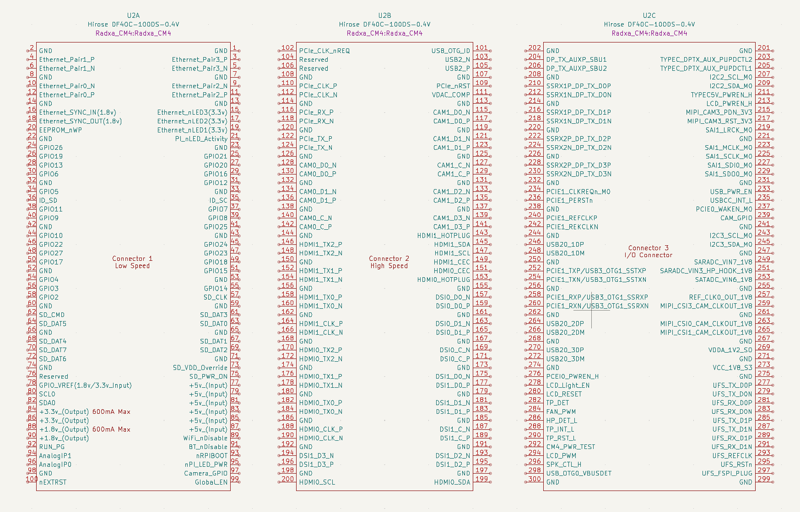

# Radxa CM4 KiCAD Library

This repository contains a [KiCAD](https://www.kicad.org/) Symbol, Footprint,
and 3D model for the [Radxa CM4](https://radxa.com/products/cm/cm4) compute module.

## Symbol Units

The KiCAD symbol consists of three units which map to the [CM4 Schematic](https://dl.radxa.com/cm4/docs/hw/radxa_cm4_schematic_v1.20.pdf) as follows:

- Unit-A is schematic reference J3A (Low Speed, page 21
- Unit-B is schematic reference J3B (High Speed, page 22)
- Unit-C is schematic reference J1 (IO Connector, page 23)

Note:  Due to the limitation of how KiCAD maps pin numbers between Symbol and Footprint, Unit-C is numbered from 201 to 300.  To match schematic reference J1's pinout subtract 200, eg:   Unit-C Pin 217 is J1's Pin 17.

## Mechanical Validation

### In progress

~~The footprint has been mechanically validated for correct fit with CM4 module.~~

## SMD Stencil

Order SMD stencil with 0.10mm thickness.

## CM5 Compute Module

KiCAD files for CM5 also [available here](https://github.com/swdee/radxa-cm5-kicad).

## References

* [Hirose DF40C-100DS-0.4V(51) connector](https://www.hirose.com/en/product/p/CL0684-4033-4-51)
* [Radxa CM4 Schematic](https://dl.radxa.com/cm4/docs/hw/radxa_cm4_schematic_v1.20.pdf) - Pages 21-23
* [Radxa CM4 IO Board Schematic](https://dl.radxa.com/cm4/cm4-io-board/docs/hw/radxa_cm4_io_schematic_v1.10.pdf) - Pages 8-10
* [Radxa CM4 IO Board Design Resources](https://github.com/radxa/radxa-cm-projects/tree/main/cm4/radxa-cm4-io-board)